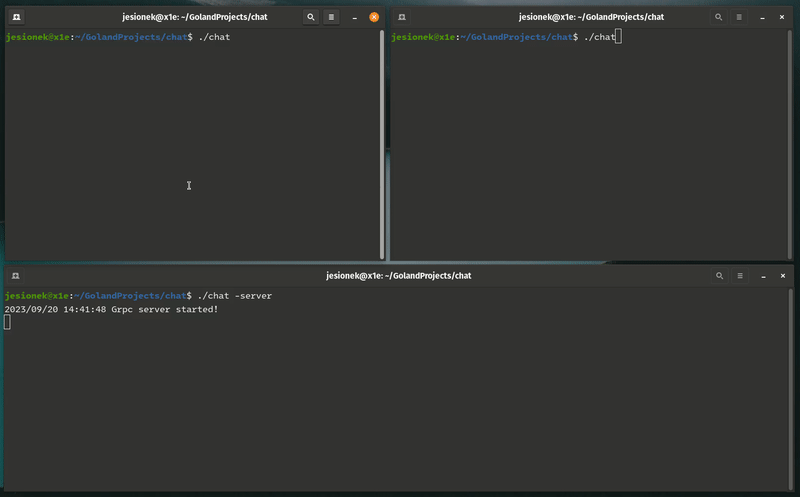

### Simple chat server and client implemented with gRPC in Golang.


### Server
The server component handles tasks such as monitoring users' online status and forwarding messages via streams. To do this it uses protocol buffers defined in the `chat.proto` file.
```
./chat -server
```

### Client

The client side is built using tview, a popular library for building terminal applications in Go.
```
./chat 
```
After registration, users can view a list of currently available users and receive notifications about incoming messages.
